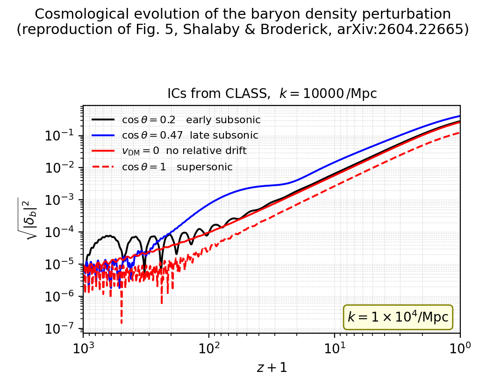

# Linear growth with DM–baryon relative drift

Reproduction of Figure 5 of Shalaby & Broderick, *The Sound of the Universe:
A Resonant Gravitational Instability Driven by Baryon–Dark Matter Relative
Drift* ([arXiv:2604.22665](https://arxiv.org/abs/2604.22665)), by solving
their equation system D50 (Appendix D): the linear evolution of coupled
baryon and CDM perturbations in an expanding FLRW background with a uniform
DM–baryon relative drift v_DM = 5 c_s at z = 1000, decaying as 1/a.

Initial conditions come from tabulated transfer functions computed with
either of the Boltzmann codes **CLASS** or **CAMB** (switchable everywhere).
The repository also generates Fortran-CAMB-format transfer/power tables for
setting cosmological-simulation initial conditions with the paper-consistent
cosmology.



## Setup

Requires [uv](https://docs.astral.sh/uv/) and a C compiler (classy builds
CLASS from source):

```bash
uv venv --python 3.12
VIRTUAL_ENV="$PWD/.venv" uv pip install numpy scipy matplotlib camb classy emcee
```

All commands below use the venv's interpreter directly
(`.venv/bin/python`); alternatively `source .venv/bin/activate` first.

## Scripts: what they do and how to run them

### `cosmo_params.py` — shared constants (imported, not run)

Single source of truth for the paper's cosmology (Ω_b0 = 0.044,
Ω_DM0 = 0.226, Ω_Λ0 = 0.73, H0 = 71 km/s/Mpc), the assumed primordial
spectrum (A_s = 2.1×10⁻⁹, n_s = 0.965 — not quoted in the paper), the
Tseliakhovich & Hirata (2010) baryon temperature / sound-speed fit, the drift
law v_DM(a) = 5 c_s(a_i)·(a_i/a) with a_i = 1/1001, and unit conversions.
Imported by every other script; edit here to change the cosmology everywhere.

### `generate_tables.py` — tabulate transfer functions & power spectra at z = 1000

Runs CLASS (Newtonian gauge) and/or CAMB at the integration start epoch
z = 1000 and writes the tables that `linear_growth.py` reads its initial
conditions from:

- `tables/<backend>_transfer_z1000.txt` — k, δ_b, δ_cdm, θ_b, θ_cdm per unit
  primordial curvature (CLASS sign convention; θ in 1/Mpc with
  dδ/dτ = −θ). CAMB output is converted to the same convention, verified
  against the continuity equation.
- `tables/<backend>_power_z1000.txt` — P_b, P_cdm, P_m in Mpc³ (the CLASS
  file carries the direct CLASS P_m(k) as a cross-check column).

```bash
.venv/bin/python generate_tables.py                  # both backends (default)
.venv/bin/python generate_tables.py --backend class  # or: camb
.venv/bin/python generate_tables.py --kmax 1.2e4     # max k in 1/Mpc
```

Takes ~1 min (CLASS) + ~2 min (CAMB) at the default kmax = 1.2×10⁴/Mpc.

### `linear_growth.py` — solve eq. D50 and reproduce Figure 5

Interpolates the chosen z = 1000 table at wavenumber k (default 10⁴/Mpc, as
in the paper's Fig. 5), normalizes to the rms primordial curvature amplitude,
and integrates the complex ODE system D50 from z = 1000 to z = 0 for the four
cases of Figure 5: no drift, cosθ = 0.2 (early subsonic), cosθ = 0.47 (late
subsonic), and cosθ = 1 (supersonic). Run `generate_tables.py` first.

```bash
.venv/bin/python linear_growth.py                       # ICs from CLASS (as the paper)
.venv/bin/python linear_growth.py --backend camb        # ICs from CAMB
.venv/bin/python linear_growth.py --backend both        # side-by-side panels
.venv/bin/python linear_growth.py --k 3e3               # another wavenumber
.venv/bin/python linear_growth.py --no-dm-drag          # eq. D50 exactly as printed
.venv/bin/python linear_growth.py --out myfig.png       # custom figure name
```

Outputs `figure5_<backend>.png` (the Fig. 5 reproduction: √|δ_b|² vs z+1)
and `outputs/delta_b_evolution_<backend>_k<k>.txt` (the curves as text).

### `transfer_ic_for_cosmo_sim.py` — IC tables for the cosmological simulation

Regenerates the Fortran-CAMB-format tables used by the simulation (samples
of the old, paper-inconsistent set are in `extras/`), with the
paper-consistent cosmology, at several redshifts, from either code:

```bash
.venv/bin/python transfer_ic_for_cosmo_sim.py --backend camb                # kmax 1.5e4
.venv/bin/python transfer_ic_for_cosmo_sim.py --backend class --kmax 3e4    # kmax 3e4
# options: --redshifts 1000 900 250 200 127 0   --k-per-decade 30
#          --output-root ic_tables/<backend>_massless
#          --class-set KEY=VALUE   (extra CLASS precision settings, repeatable)
```

For each redshift it writes, byte-format identical to the `extras/` samples:

- `<root>_z<Z>_transfer_k.dat` — the 13-column CAMB transfer format: k/h,
  then Δ_i/k² (unit primordial curvature, k in 1/Mpc) for cdm, baryon,
  photon, ν, massive ν (=0), total, no-ν, total-de, the Weyl potential, and
  the Newtonian-gauge velocity transfers v_cdm, v_b, v_baryon−cdm.
- `<root>_z<Z>_power_k.dat` — k/h vs P_tot(k) in (Mpc/h)³.

CLASS output is converted to CAMB's conventions (CDM-comoving-frame
densities via the gauge shift δ → δ + 3ℋ(1+w)θ_cdm/k²; relative velocity
v_bc = (θ_cdm−θ_b)/k³), all verified numerically: the two backends agree to
~1–2% at k = 10⁴/Mpc for z ≥ 127. At z ≈ 0 the *baryon* columns at such k
are below the baryon Jeans scale and genuinely code-dependent.

The two production sets in `ic_tables/` are `camb_massless_*`
(kmax = 1.5×10⁴/Mpc) and `class_massless_*` (kmax = 3×10⁴/Mpc). These are
the empirical high-k limits of each code: CAMB's Dverk integrator hard-fails
for kmax ≳ 1.5–2×10⁴/Mpc (and at lower kmax if AccuracyBoost is raised),
while CLASS runs to arbitrary kmax but its output beyond k ≈ 3.5×10⁴/Mpc is
dominated by per-mode integration noise (verified by the cdm-column tail at
z = 0); tightening `tol_perturbations_integration` triggers minimum-step
failures and the alternative `evolver=0` (rk) blows up exponentially beyond
k ≈ 2×10⁴/Mpc, so k ≳ 10⁵/Mpc is not attainable with stock classy 3.3.

### `mcmc_max_enhancement.py` — find the maximally enhanced mode with emcee

Explores eq. D50 over k ∈ [5×10², 10⁴]/Mpc and cosθ ∈ (0, 1) with an MCMC
(emcee) whose ln-probability is β·ln E, where
E = |δ_b|_drift/|δ_b|_no-drift at z_eval — so the chain concentrates on the
(k, cosθ) combinations that maximise the Fig. 5 enhancement over the
no-relative-drift case. Run `generate_tables.py` first.

```bash
.venv/bin/python mcmc_max_enhancement.py                  # defaults: 32x400 chain
.venv/bin/python mcmc_max_enhancement.py --kmin 5e2 --kmax 1e4 --z-eval 0 \
    --nwalkers 32 --nsteps 400 --burn 100 --beta 10 --backend class
```

Outputs `mcmc_enhancement_samples.png` (sample cloud in (k, cosθ) coloured
by E, best point starred), `figure5_best_enhancement.png` (Fig. 5-style
evolution of the best mode vs no drift and supersonic), and
`outputs/mcmc_enhancement_chain.npz`.

## Gadget-4 simulation plan (`cosmo_sim_plan/`)

`cosmo_sim_plan/` contains the plan for seeing this instability and its
non-linear evolution in a cosmological simulation:

- `sim_plan.md` — the full design: box size / particle number from the
  resolution requirements, two-fluid ICs via the patched N-GenIC and the
  `ic_tables/` transfer files, how to impose the (automatically 1/a-decaying)
  uniform relative drift, start-redshift choices, run matrix, analysis
  quantities, and risks.
- `Config.sh`, `param.txt` — ready-to-use Gadget-4 configuration for the
  fiducial run (2×256³ particles, 50 ckpc box, z = 200 → 0, paper cosmology),
  with every change from the old setup annotated.
- `compare_temperature.py` — quantifies the `InitGasTemp` choice: compares
  adiabatic T(z) against the TH2010 temperature (which includes partial
  Compton coupling to the CMB) and motivates the asymptote-matched value
  T_init = T_cmb·a₁·(1+z_start)² (916.7 K at z = 200).

## CAMB vs CLASS transfer-function conventions

The two codes tabulate perturbations differently. Everything below is per
unit primordial curvature perturbation R = 1; k is in 1/Mpc (except the k/h
column of CAMB files); ℋ ≡ aH/c is the conformal Hubble rate in 1/Mpc; θ ≡
ik·v is the velocity divergence in 1/Mpc using conformal time (so the
continuity equation reads dδ/dτ = −θ). These relations were all verified
numerically in this repo (continuity-equation checks and 1–2% cross-backend
agreement).

**CLASS** (`get_transfer(z, output_format='class')` with `gauge: newtonian`):

| quantity | CLASS output |
| --- | --- |
| densities | `d_b`, `d_cdm`, `d_g`, `d_ur` = δᵢ in the **Newtonian gauge** |
| velocities | `t_b`, `t_cdm`, … = θᵢ [1/Mpc], Newtonian gauge |
| metric | `phi`, `psi` (Newtonian potentials) |
| sign | δ < 0 at late times for R = +1 |

Note `t_cdm` exists only in the Newtonian gauge (in CLASS's default
synchronous gauge it is zero by gauge fixing).

**CAMB** (`get_matter_transfer_data()` / the Fortran `*_transfer_k.dat`
files, 13 columns):

| column | CAMB output |
| --- | --- |
| 1 | k/h [h/Mpc] |
| 2–9 | Δᵢ/k² for cdm, b, γ, ν, massive ν, tot, no-ν, tot-de — densities in the **CDM-comoving frame** (≈ synchronous), opposite overall sign to CLASS |
| 10 | Weyl potential: −(φ+ψ)/2 |
| 11, 12 | v_Newt_cdm, v_Newt_baryon: Newtonian-gauge velocity transfers Tᵥ with θᵢ = −ℋ Tᵥ k² (CAMB sign) |
| 13 | v_baryon−cdm: physical relative velocity transfer, (θ_cdm − θ_b)/k³ in CLASS sign |

**Converting CLASS → CAMB columns** (as implemented in
`transfer_ic_for_cosmo_sim.py`):

```
gauge shift to the CDM-comoving frame:   δ'ᵢ = δᵢ + 3ℋ(1+wᵢ) θ_cdm / k²
   (wᵢ = 0 for cdm/baryons, 1/3 for photons/neutrinos)
density column:    Tᵢ   = −δ'ᵢ / k²
velocity columns:  Tᵥ,ᵢ = +θᵢ / (ℋ k²)
relative velocity: T_vbc = (θ_cdm − θ_b) / k³
Weyl column:       −(phi + psi)/2
```

The gauge shift only matters near/above the horizon for the matter columns
(23% at k ≈ 0.007/Mpc at z = 250, <0.3% sub-horizon) but is essential at all
k for the tiny free-streaming photon/ν columns.

**Converting CAMB → CLASS conventions** (as implemented in
`generate_tables.py`):

```
δᵢ (CLASS sign) = −Tᵢ k²
θᵢ [1/Mpc]      = +ℋ Tᵥ,ᵢ k²
```

(Newtonian-gauge velocities are what eq. D50 needs; the residual
Newtonian-vs-CDM-frame density difference is negligible at k = 10⁴/Mpc,
which is deeply sub-horizon at z = 1000.)

**Power spectra**: both codes normalize to the primordial spectrum
P_R(k) = (2π²/k³) A_s (k/k_pivot)^(n_s−1). The CAMB `*_power_k.dat` files
contain P_tot(k) = P_R(k) · (T_tot k²)² · h³ in (Mpc/h)³ against k/h; the
CLASS-side `tables/*_power_z*.txt` use the same formula per species, in Mpc³
against k.

## Repository layout

| Path | Content |
| --- | --- |
| `cosmo_params.py` | shared cosmology and constants (imported by all scripts) |
| `generate_tables.py` | z = 1000 transfer/power tables for the ODE initial conditions |
| `linear_growth.py` | eq. D50 solver, Figure 5 reproduction |
| `transfer_ic_for_cosmo_sim.py` | CAMB-format IC tables for the simulation |
| `mcmc_max_enhancement.py` | emcee search for the (k, cosθ) maximising the drift enhancement |
| `cosmo_sim_plan/` | Gadget-4 simulation plan, configuration files, and `compare_temperature.py` |
| `tables/` | z = 1000 tables read by `linear_growth.py` |
| `ic_tables/` | simulation IC tables (CAMB and CLASS sets) |
| `outputs/` | |δ_b|(z) evolution curves as text |
| `extras/` | sample of the old (paper-inconsistent) simulation IC tables |
| `figure5_*.png` | Figure 5 reproductions (CLASS, CAMB, side-by-side) |

## Notes

- The printed Eq. D50 omits the −2 t_DM Hubble-drag term that appears in its
  precursor equations (apparently a typo); it is included by default, and
  `--no-dm-drag` integrates the system exactly as printed.
- The paper's Fig. 5 caption and body text disagree on the red linestyles;
  the body text (solid = no drift, dashed = supersonic) matches the figure
  and is used here.
- A_s and n_s are assumed (not quoted in the paper), so the overall
  normalization of |δ_b| may differ from the paper by an O(1) factor; the
  shapes, mode ordering, and amplification/suppression factors reproduce.
